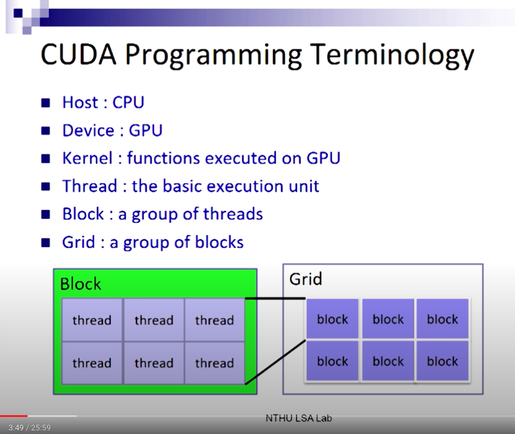

# learn_cuda


#Notes
### Terminology


### Kernel, blocks, threads
* 架構層級： kernel > blocks > threads
    - threads are grouped into thread `blocks`.
    - `kernel` = grid of thread blocks.
    - 一個 kernel 裡面包含 N 個 blocks, 每個 block 裡面有 k 個 threads。
    - 在同一個 block 中要考慮sync問題：每個 thread 執行一個 data element，平行運算。如果運算間有 dependency 時，就要用 `__syncthreads()` 擋住，讓所有的 thread 都算完前一個步驟，再往下。 Example: 
    ```
    scratch(threadID) = begin(threadID);
    __syncthreads();
    int left = scratch(threadID -1);   //會用到 threadID -1，所以要等這個 block 的所有 thread 都執行完才能做。
    ```
    - blocks 之間是互相獨立的。被 assign 到的 processor 位置也不一定照順序。**blocks 沒辦法被同步化**，跨 processor 沒有任何同步機制。

### Memory Hierarchy
根據希望給誰用，分成三個層級：

1. `Per-thread Local Memory`: 在某一個 thread裡面，只有該 thread 可以用。
2. `Per-block Shared Memory`: 該 block 裡面的所有 thread 都可以 access。
3. `Per-device Global Memory`: 跨 kernel 的運算、當 kernel 之間有 dependency 時，就可以把結果存在 global memory，提供所有人用。 global memory 跟 process 共同存在，只要 process 沒有被 free 掉， global memory 就存在。


### Compile the code
```
nvcc -o kernel kernel.cu
```


# Reference
* A simple tutorial made in 2013: https://www.youtube.com/watch?v=_41LCMFpsFs


* https://www.youtube.com/watch?v=Ed_h2km0liI&list=PL5B692fm6--vScfBaxgY89IRWFzDt0Khm&index=24&t=0s 

* https://developer.nvidia.com/blog/easy-introduction-cuda-c-and-c/ 

* 中文 tutorial: https://kheresy.wordpress.com/2008/01/15/nvidia-cuda-%e7%9b%b8%e9%97%9c%e6%96%87%e7%ab%a0%e7%9b%ae%e9%8c%84/ 

* 中文教學pdf: http://epaper.gotop.com.tw/pdf/ACL031800.pdf 

* NTHU 線上課程： 周志遠老師的[平行程式](https://youtu.be/t_q0Tajpyso) 從第15講開始

* PyTorch [C++ distribution](https://pytorch.org/cppdocs/installing.html)