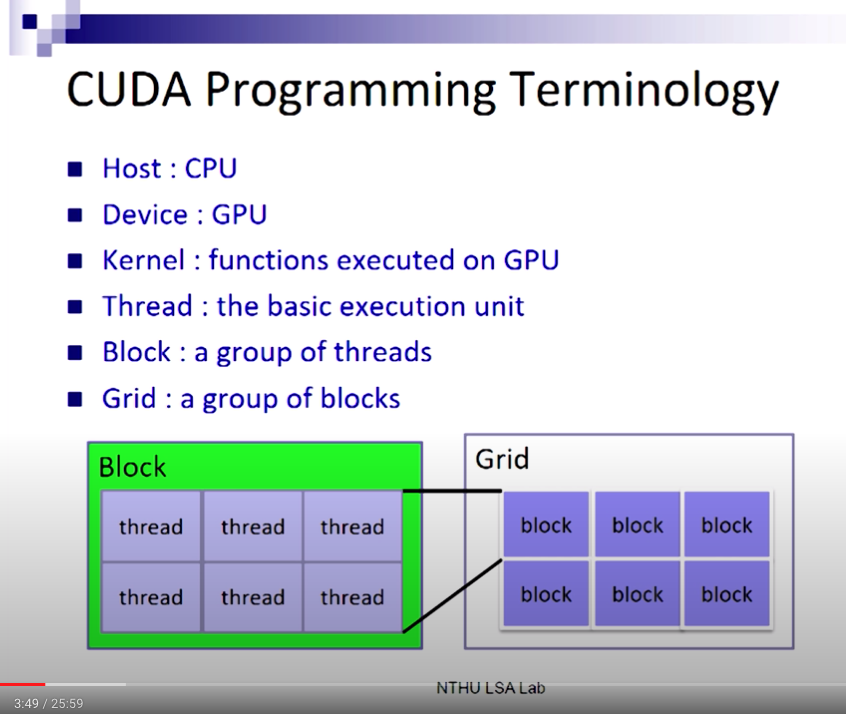

### Terminology


### Kernel, blocks, threads
* 架構層級： kernel > blocks > threads
    - threads are grouped into thread `blocks`.
    - `kernel` = `grid`
    - 一個 kernel 裡面包含 N 個 blocks, 每個 block 裡面有 k 個 threads。
    - 在同一個 block 中要考慮sync問題：每個 thread 執行一個 data element，平行運算。如果運算間有 dependency 時，就要用 `__syncthreads()` 擋住，讓所有的 thread 都算完前一個步驟，再往下。 Example: 
    ```
    scratch(threadID) = begin(threadID);
    __syncthreads();
    int left = scratch(threadID -1);   //會用到 threadID -1，所以要等這個 block 的所有 thread 都執行完才能做。
    ```
    - blocks 之間是互相獨立的。被 assign 到的 processor 位置也不一定照順序。**blocks 沒辦法被同步化**，跨 processor 沒有任何同步機制。

* kernel 的呼叫方式： `my_kernel<<< N_blocks, N_threads_in_a_block >>>`
  - `my_kernel<<<1, 100>>>(A)` : 只有一個 block， 100 個 thread 全部放在裡面。
        - 好處：100 個 thread 可以同時做 synchronization，也可以用 shared mem 讓這些 thread 溝通。
  - `my_kernel<<<100, 1>>>(A)` : 有 100 個 block，每個 block 裡面都只有一個 thread。
        - 好處： 100 個 block 可以獨立 schedule，等待時間會比較短。  
        - 一般會拆成 32 來用，以 wap 為單位。


### Memory Hierarchy
根據希望給誰用，分成三個層級：

    1. `Per-thread Local Memory`: 在某一個 thread裡面，只有該 thread 可以用。
    2. `Per-block Shared Memory`: 該 block 裡面的所有 thread 都可以 access。
    3. `Per-device Global Memory`: 跨 kernel 的運算、當 kernel 之間有 dependency 時，就可以把結果存在 global memory，提供所有人用。 global memory 跟 process 共同存在，只要 process 沒有被 free 掉， global memory 就存在。


### CUDA Language
* Basic functions:


* Thread and Block IDs
    - kernel, block, 都可以是 3 維的，會用 `dim3` 來描述它的大小，再當作 kernel 的設定參數。
    Example:
    ```
    dim3 grid(3,2);
    dim3 blk(5,3);
    my_kernel<<< grid, blk >>>();
    ```
    -  每個 thread 都會有一個 unique ID，根據你如何定義 kernel 跟 block 而改變
    
    1. 因為所有 thread 都在同一個 block 裡面，所以 i = threadIdx
    2. 因為所有 block 裡都只有一個 thead，所以 i = blockIdx
    3. 最 general 的情況： i = blockIdx * blockDim + threadIdx


* Function Qualifiers:
讓 compiler 知道要不要 generate 這個 function，要不要 load 到 GPU。

    - `__device__`: 在 device execute, 只能在 device call。只能在 GPU call
    - `__global__`: 在 device execute, 只能在 host call。由他進入GPU
    - `__host__`  : 在 host execute, 只能在 host call 。只能在 CPU call。
    - 沒有指定     : 在 host compile

* Variable Type Qualifiers 

    - `__device__`  : 就是在 Global mem。
    - `__constant__`: 跟 global 類似，但是 read only。 Run time 不能修改。速度會比較快。會做 Caching。
    - `__shared__`  : 在 Shared mem 裡面。 lifetime 跟隨著 block， block 執行完就沒了。
